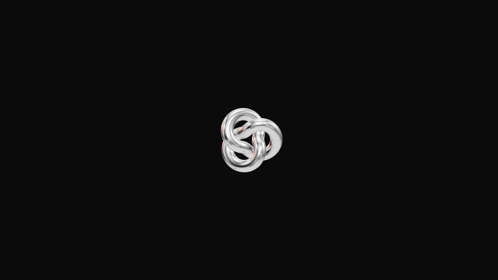
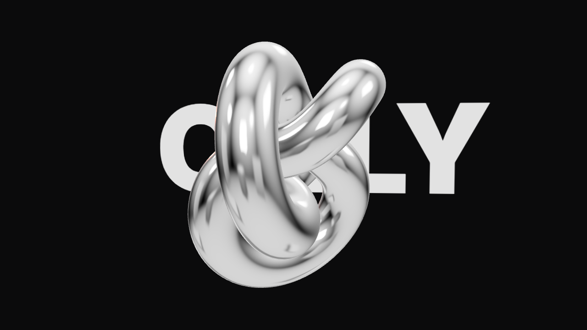
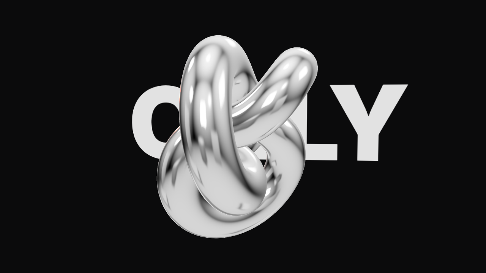
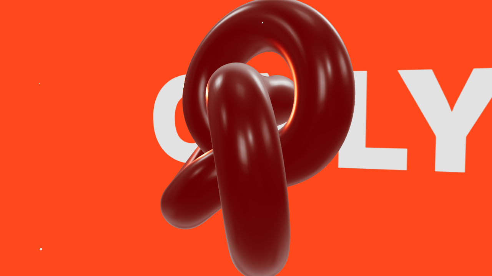
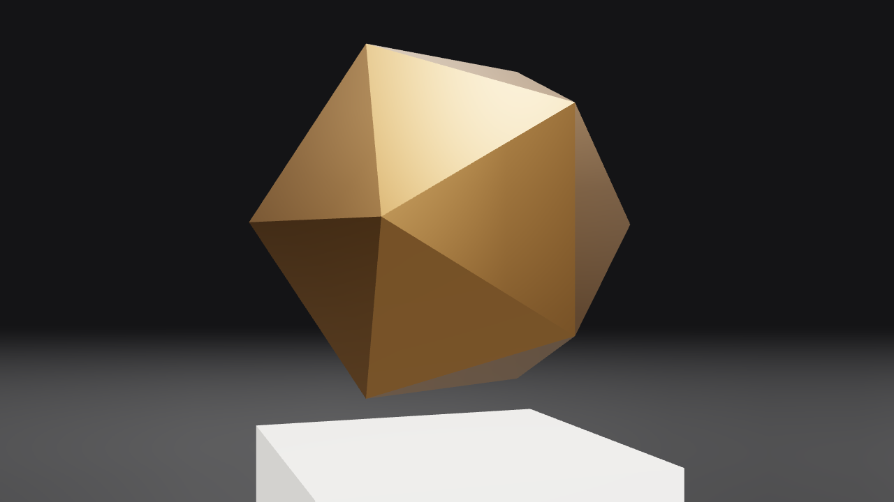
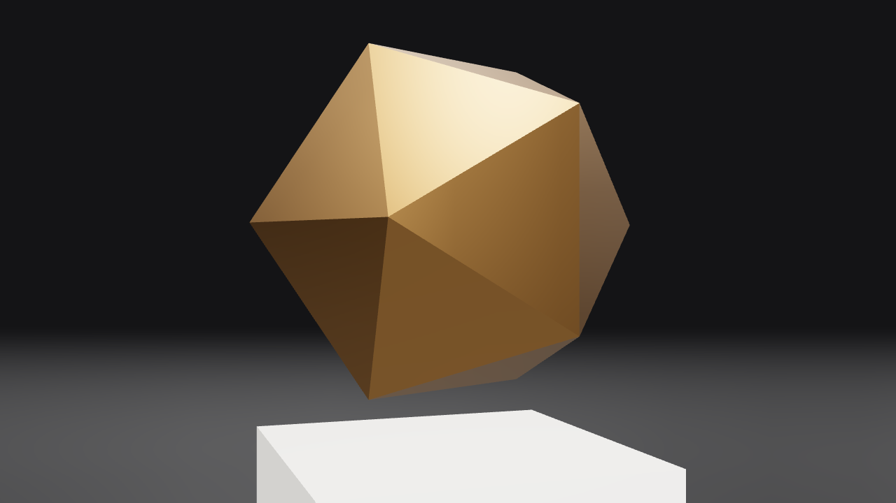
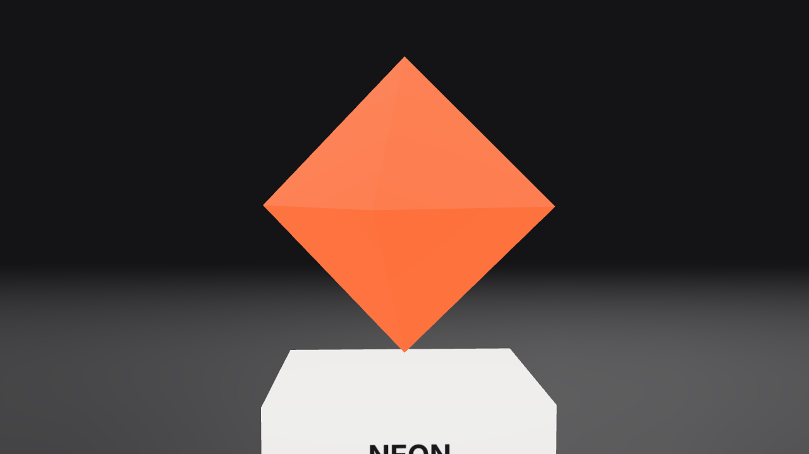
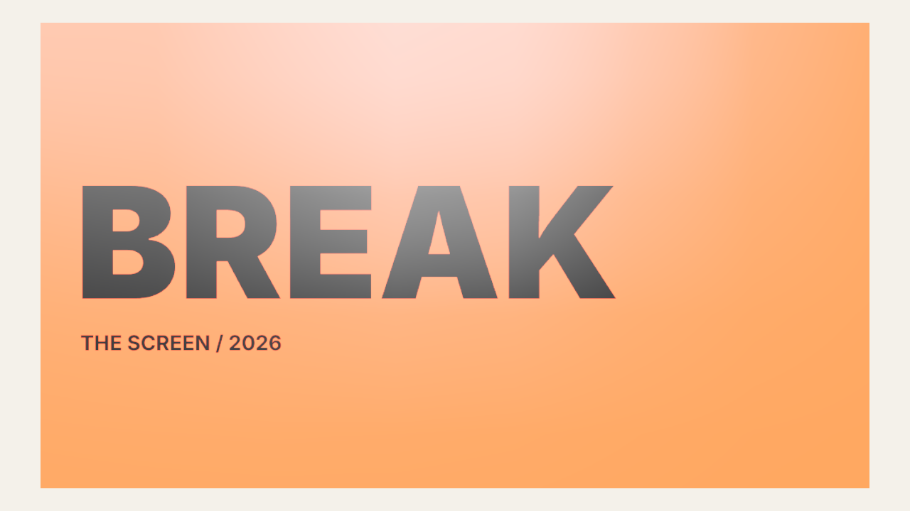

# カット表（自動生成：npm run cuts）

FBは src/cuts.js の `fb` に書く。

| ID | 尺 | はじめ | おわり | 動き | Webでの操作 | FB |
|---|---|---|---|---|---|---|
| C01 | 0.0–1.2s |  |  | オブジェクトが奥から弾けるように登場 | — |  |
| C02 | 1.2–4.5s |  |  | ビートごとにクローム/ワイヤー/トゥーン/赤リムへ質感が切り替わる。奥にCODE/ONLY/MOTION | 3回クリック |  |
| C03 | 4.5–5.6s |  |  | ステッカーが画面を覆い、剥がれると美術館 | — |  |
| C04 | 5.6–9.4s |  |  | 素材の図鑑。像ごとに画角を変え ease-in-out で巡る | ドラッグで歩く |  |
| C05 | 9.4–11.4s |  |  | ステッカー転換 → テーマカラーのポスター | クリックで割る |  |
| C06 | 11.4–15.0s |  |  | ポスターが割れて破片が飛散、白地にロゴ | Replay |  |
