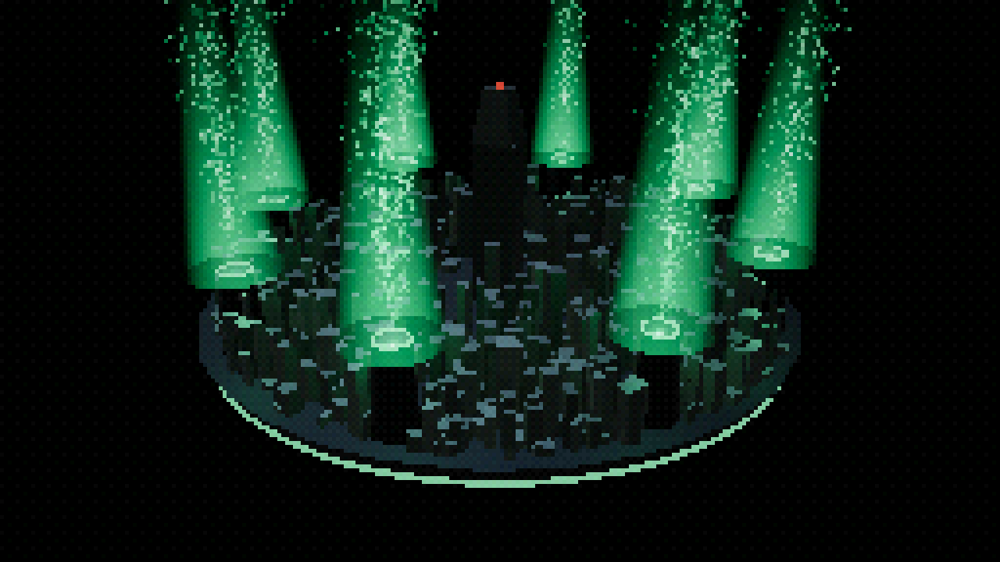
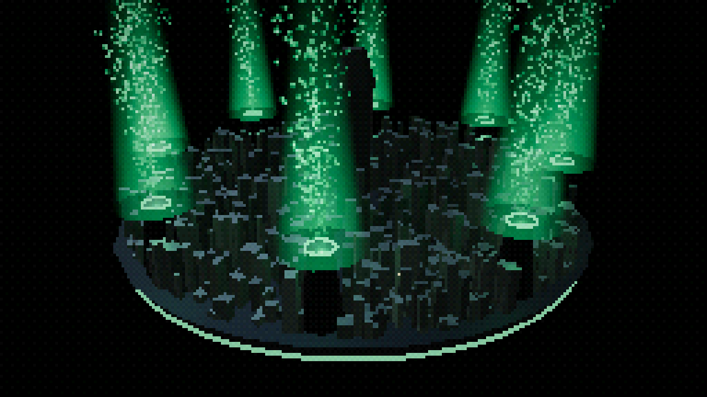
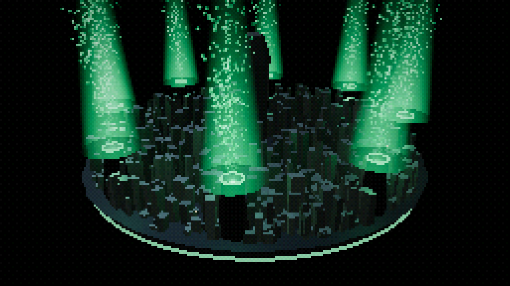
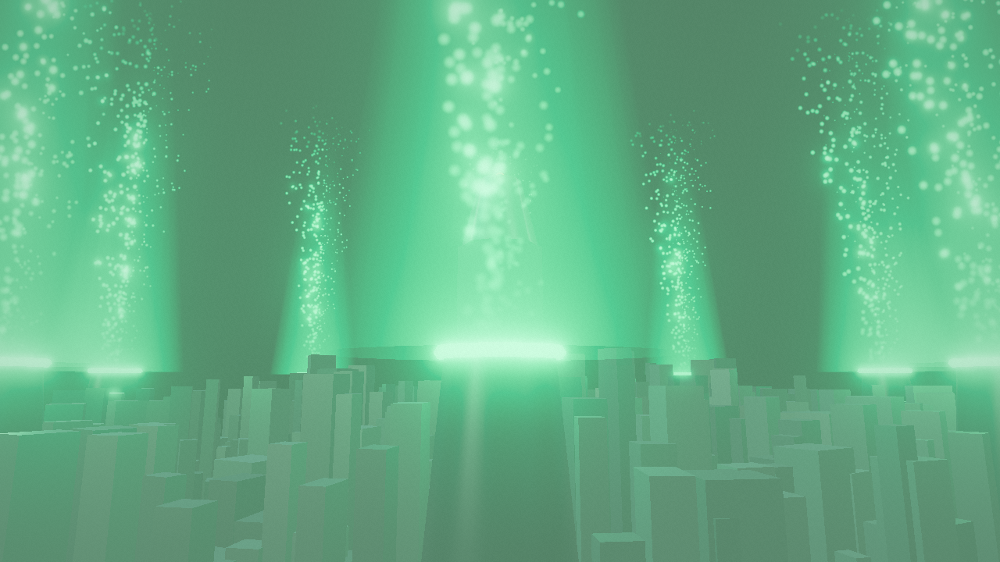
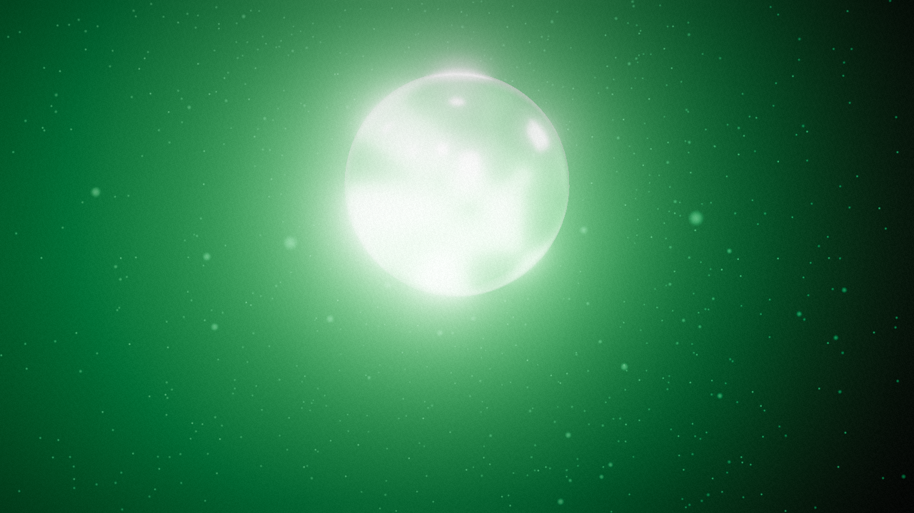
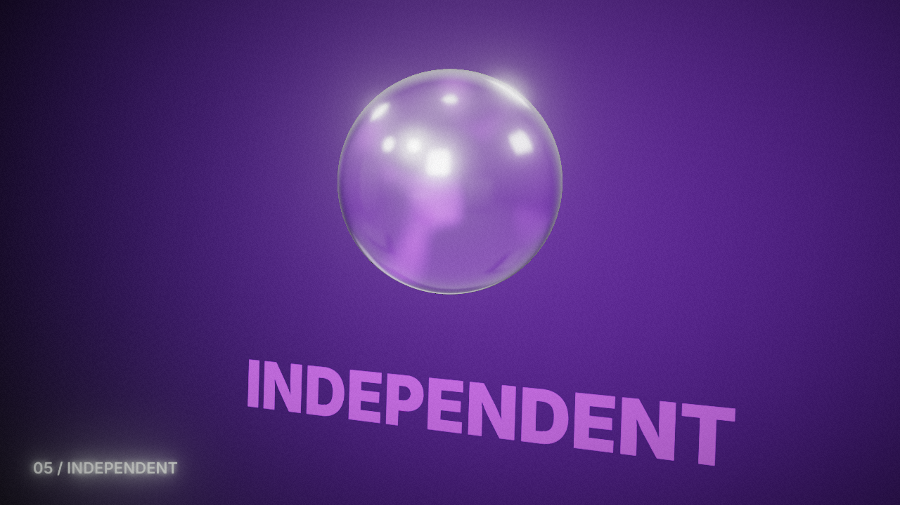
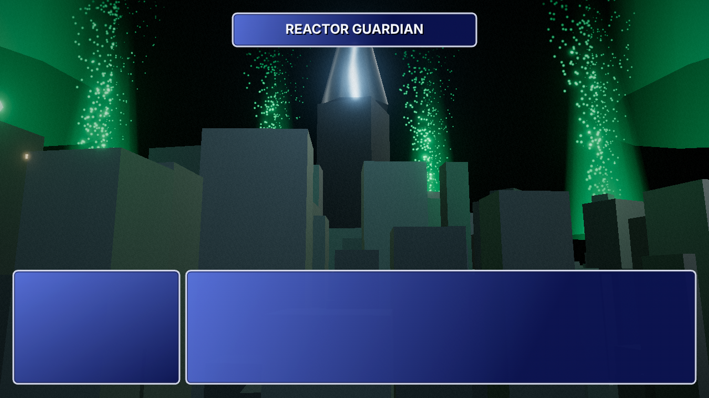
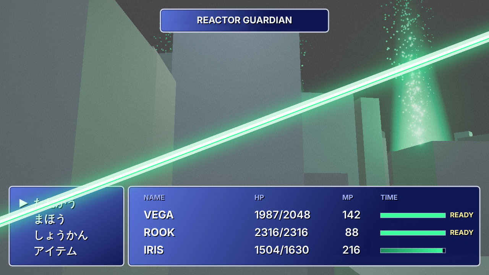
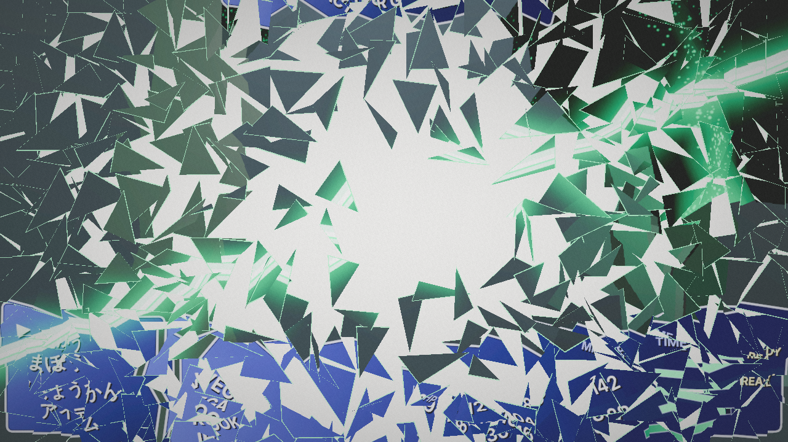
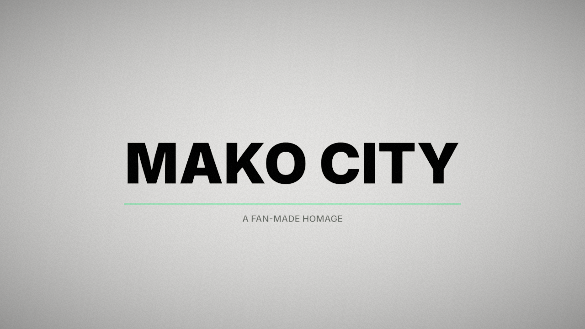

# MAKO CITY カット表 v1

映像: out/mako.mp4（15秒 / 140BPM / 30fps）

**FB の書き方**: 一番右の「FB」列に「何が・なぜダメで・何に合わせるか」を書いてください（チャットに書くだけでもOK）。

| ID | 尺 | はじめ | おわり | 肝 | 動き | 自己レビュー（AI） | FB |
|---|---|---|---|---|---|---|---|
| C01 | 0.0–3.0s |  |  | PS1画質の円盤都市と8本の光の柱 | 斜め上空からゆっくり回りながら寄る（PS1：カクカク・15bitカラー） | PS1らしさ（カクカク・色数）は出たが、都市の外が真っ黒で宙に浮いて見える。空やスモッグの層があると世界が広がる |  |
| C02 | 3.0–6.0s |  |  | 4.29s、緑の閃光で HD に解像度が上がる瞬間 | 外周を回り込んで炉へ急降下。半拍ごとに解像度 5→3→2→1 | HDに上がる瞬間の緑の閃光は効いている。終わりのカットで炉そのものが画面に映らず、どこに着いたかが弱い |  |
| C03 | 6.0–9.0s |  |  | 光が集まってできる宝珠 | 粒子が渦を巻いて集まり宝珠に。ビートごとに緑→赤→黄→青→紫、奥に色の言葉 | 白飛びと文字の隠れは修正済み。宝珠の中の渦がまだ小さく、宝珠らしい「中で何かが渦巻く」感じが弱い |  |
| C04 | 9.0–12.0s |  |  | ゲージ満タン →「たたかう」→ 斬撃 | 低いアングルの都市に青いウィンドウ。ゲージが溜まり READY、カーソル、白い斬撃 | ウィンドウとゲージは狙いどおり。手前のビルが大きなグレーの箱に見えるので、ディテールか高さが要る |  |
| C05 | 12.0–15.0s |  |  | 白地のタイトル | 斬撃の画面がそのまま割れて飛散、MAKO CITY | 斬撃の画面がそのまま割れる流れは成立。タイトルは静かで良いが、もう少しタメ（間）があってもいい |  |
