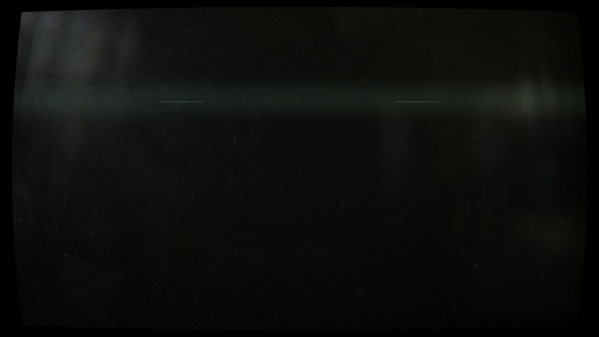
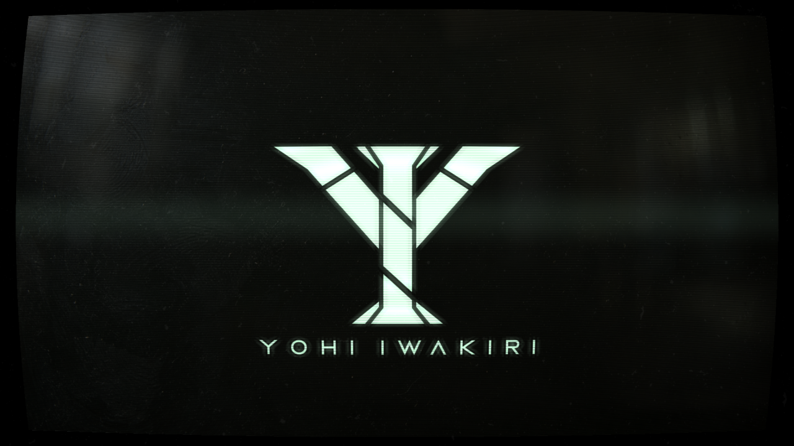
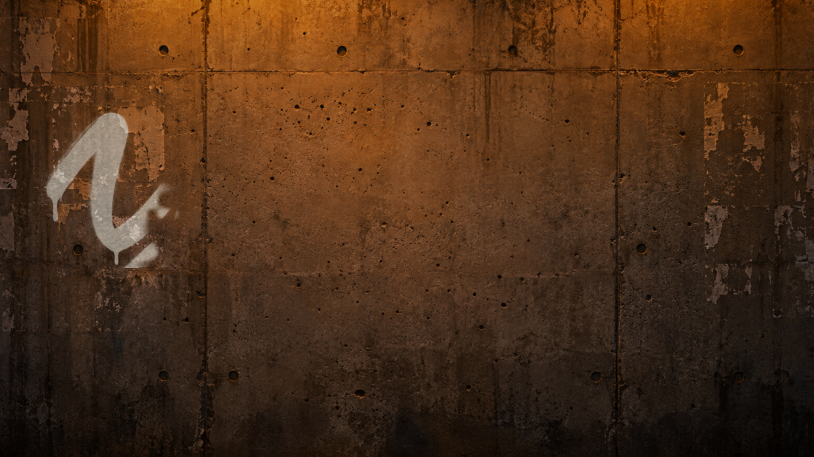
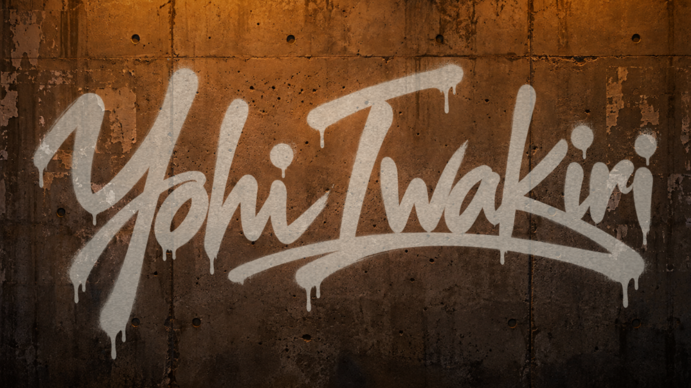
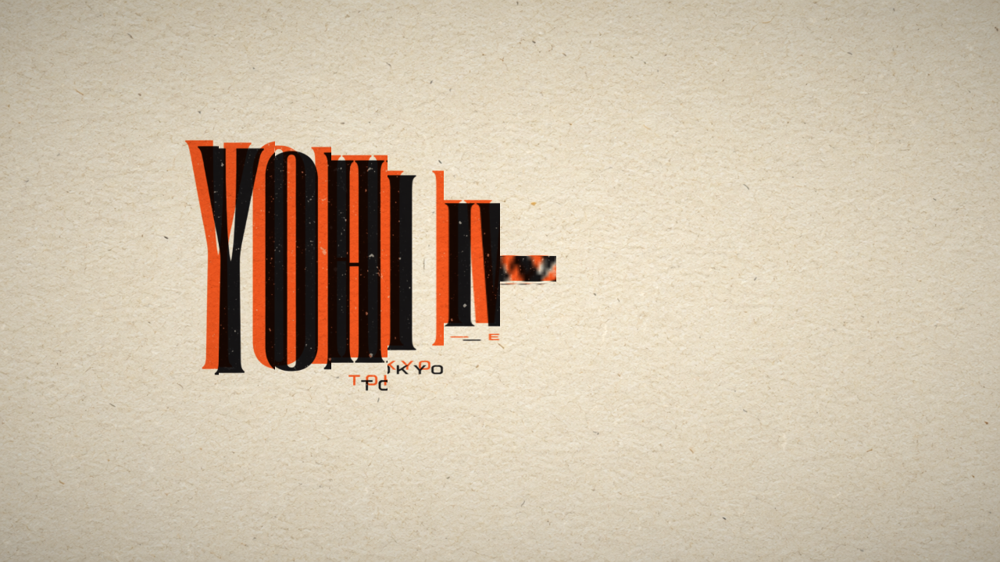
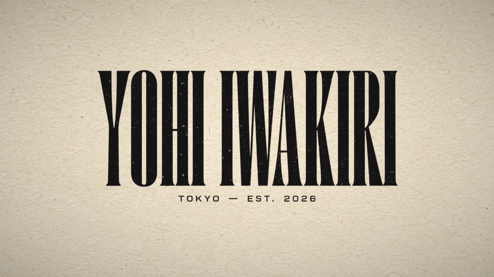
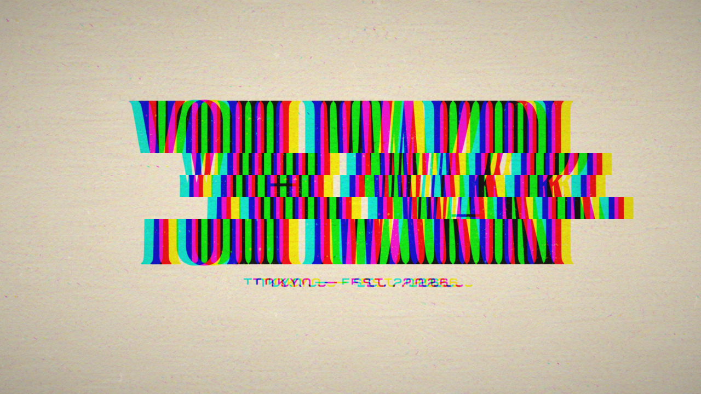
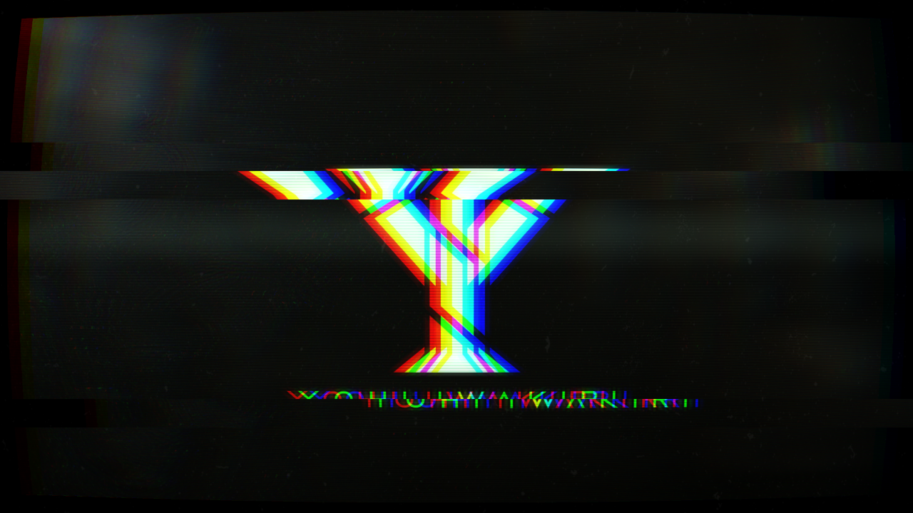
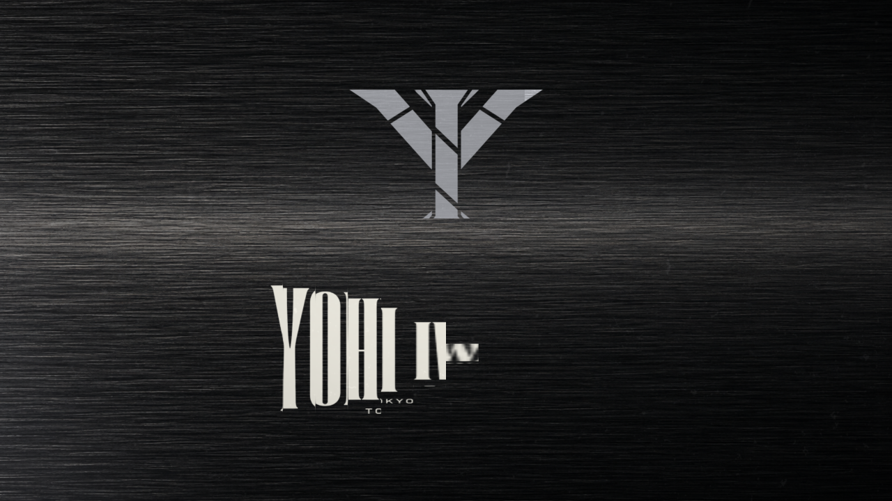
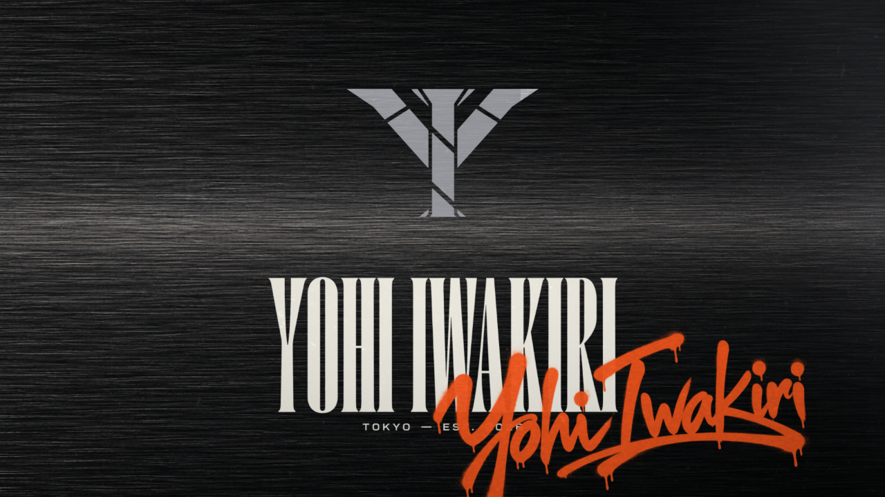

# YOHI IWAKIRI ロゴ映像 カット表 v1

15秒 / 120BPM（1拍0.5秒）/ 30fps。素材：ロゴ3案（A・B・D）＋質感5枚（Codex生成）、動きと合成はコード。

**FBの書き方**：一番右の「FB」列に書くか、チャットで「C2 ○○」のように送ってください。
「何が」「なぜ」「何に合わせて」が入っていると一発で直せます（例：「C3 揃う瞬間が遅い。拍の頭に合わせて」）。

| ID | 尺 | はじめ | おわり | 肝 | 動き | FB |
|---|---|---|---|---|---|---|
| C1 SIGNAL | 0–3s |  |  | ブラウン管に D が組み上がる | 電源が入る → Dが横の帯に分かれ、8分音符ごとに左右から滑り込む。走査線とロール帯 |  |
| C2 STREET | 3–6s |  |  | 壁に B が吹き付けられる | 左から右へスプレーで描かれ、描き終わると下に垂れる。手持ちの揺れ、ナトリウム灯のちらつき |  |
| C3 MODE | 6–9s |  |  | 版ズレの2色がぴたっと揃う | Aが1列ずつ縦に伸びて現れ、オレンジと黒がずれた状態から重なる（リソグラフ） |  |
| C4 GLITCH | 9–12s |  |  | 3つの顔の高速切り替え | 0.25秒ごとにA・B・Dが入れ替わる。ブロックずれ、色ずれ、反転、拍の頭で白く光る |  |
| C5 LOCKUP | 12–15s |  |  | モードの上にストリートのサイン | 金属の上にDが落ち、Aが伸びて現れ、最後にBをオレンジで右下に吹き付ける |  |

## 自分で直したところ（v1を出す前）
- C2：黒いスプレーが壁に沈んで影に見えた → 白っぽいスプレーに
- C5：Bがロゴ全体に重なってごちゃついた → 右下のサインに。Dはマークだけにして名前の二重表示をなくした
- C1：Dが上に寄っていた → 中央へ
- C4：入れ替わりの順番が単調 → ランダムに

## まだ入っていないもの
- 音（ビート・スプレー音・ブラウン管のノイズ）

---

# v2（試写室のFBを反映）

| ID | v1でのFB | v2での対応 |
|---|---|---|
| C1 | おっ（かっこいい・質感がいい）／GPT案に賛成 | 画面の端ほどRGBがずれて暗くなる（ブラウン管の収束ズレ）＋遠いにじみを追加 |
| C2 | ん？（安っぽい・よくある感じ）／両案に賛成 | 手で描くリズム（速く→溜め→「I」を一気に→残り）、ノズルの光、線の芯は濃く縁は薄く、縁に飛沫、滴りは描き終わってから重力で伸びる、描き終わりの拍でカメラが寄る |
| C3 | ん？（なんか違う・安っぽい・わかりにくい・地味） | 根本から2案に。**A「表紙」**＝オレンジの紙に巨大な文字、拍ごとのハードカット→引き。**B「刷り」**＝紙が送られ、拍ごとにオレンジ版→黒版がガシャンと刷られ、最後に一発で揃う |
| C4 | おっ（かっこいい・気持ちいい・テンポ）／両案に賛成 | テンポ（0.25秒）は残して2案に。**A「ステッカー」**＝顔がステッカーとして壁に叩きつけられ積み重なる。**B「整えたグリッチ」**＝色ずれは赤とシアンの細い縁だけ、横ずれは一部の帯だけ |
| C5 | おっ（かっこいい・質感がいい） | 変更なし |

- A案まとめ：`docs/v2/sheet-a.png` ／ B案まとめ：`docs/v2/sheet-b.png`
- 書き出し：`node scripts/render.mjs --page yohi/ --query 'c3=b&c4=b' --name yohi-v2b`

---

# v3（v2のA/B選択と反応を反映）

| ID | v2でのFB | v3での対応 |
|---|---|---|
| C1 | ん？「もっと迫力がほしい」（2.9s） | 帯を16分音符の速さで畳みかけ（動く帯は横に流れるブラー）、2.0s の拍で「電圧が跳ねる」衝撃：ロゴが一瞬大きく・画面が揺れて白く焼け・横一文字の光。以降は拍ごとに呼吸。ロゴも少し大きく |
| C2 | ん？「インクが垂れる演出はもっと印象的に出来そう」（5.1s） | 描き終わりの拍から、塗料が画面下まで長く垂れる。1本ごとに位置・太さ・長さ・速さが違い、重力で加速、先に丸い雫、濡れたつや |
| C3 | A/B で **B「刷り」** | B案に一本化 |
| C4 | A/B で **B「整えたグリッチ」**（Aのステッカーは「わかりにくい」） | B案に一本化 |
| C5 | — | 変更なし |

---

# v4（音を付けた）

- 映像は v3 のまま。音はすべてコードで合成：`node yohi/audio/build.mjs` → `yohi/assets/audio/score.wav`（48kHz・ステレオ、-14.6 LUFS / ピーク -1.7 dBTP）
- 映像との合体：`ffmpeg -i out/yohi-v3.mp4 -i yohi/assets/audio/score.wav -map 0:v -map 1:a -c:v copy -c:a aac -shortest out/yohi-v3-sound.mp4`
- 参考：FunTech は音を `gen/audio/` に68個の m4a（BGMループ9本＋効果音）として置き、Web Audio で16分音符に揃えて鳴らしている。こちらも同じ「ファイルに書き出して、コードで鳴らす」形にして、次の体験型サイトで使い回す。

# v5（音のFBを反映）

| ID | v4でのFB | v5 |
|---|---|---|
| C1 | 「ブーンが弱い」 | 電気が溜まる唸り（低いノコギリ波が音程・明るさ・音量とも上昇）→ 直前で切れて衝撃 |
| C2 | 「インクの垂れる音がいまいち心地よくない」 | 雫を作り直し：音程が上がる水滴の音、16分音符、Eマイナー・ペンタトニックで下降 |
| C3 | 「ポンポンポンって音がチープ」 | ピッチの下がるキックをやめ、ラッチ→重い打撃→金属の共鳴（雑音を共鳴フィルタに通す）→空気の抜け、の4層に |
| C4 | 「もっと迫力のある音ハメがほしい」 | 顔の切替ごとに歪んだパワーコードの一撃（顔ごとに音程、1回おきにビットクラッシュ）、最後の拍はスタッター |
